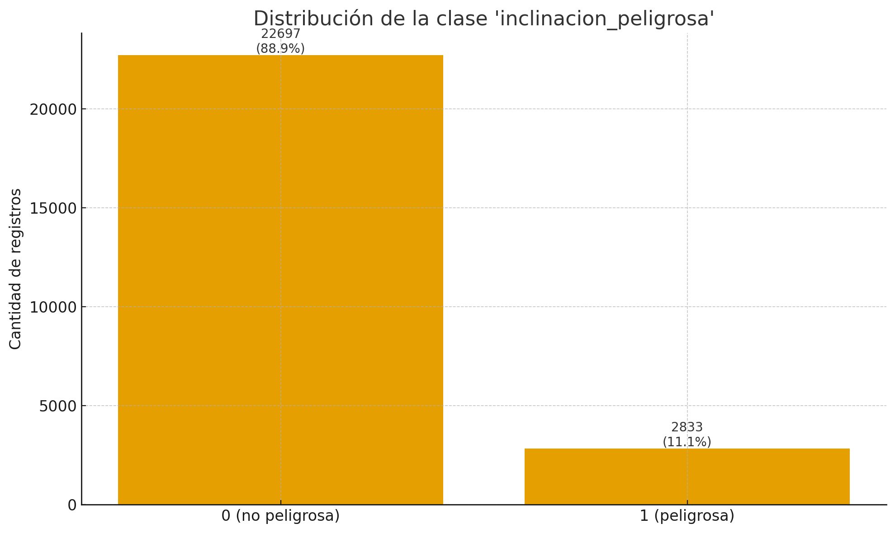
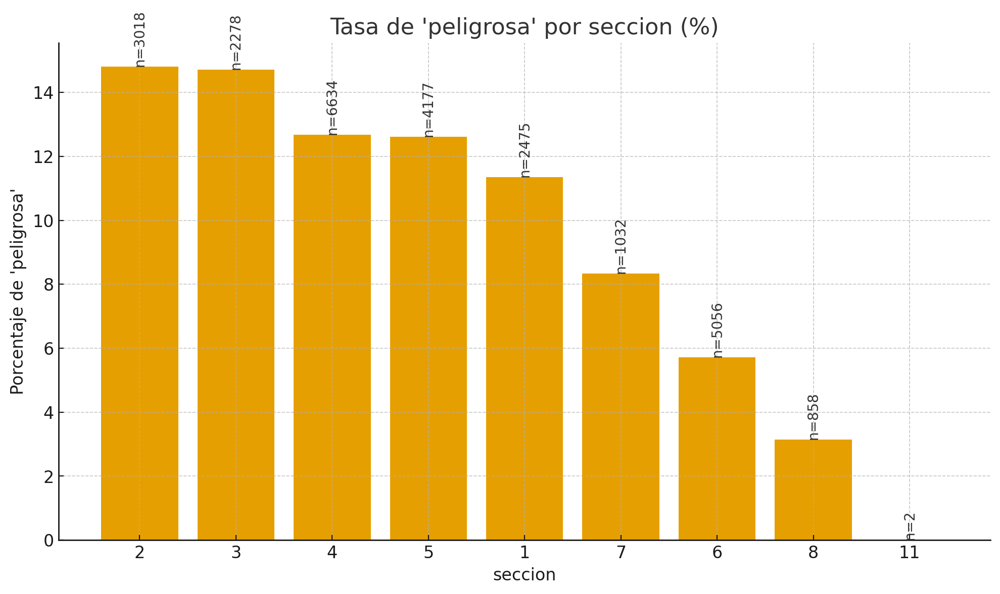
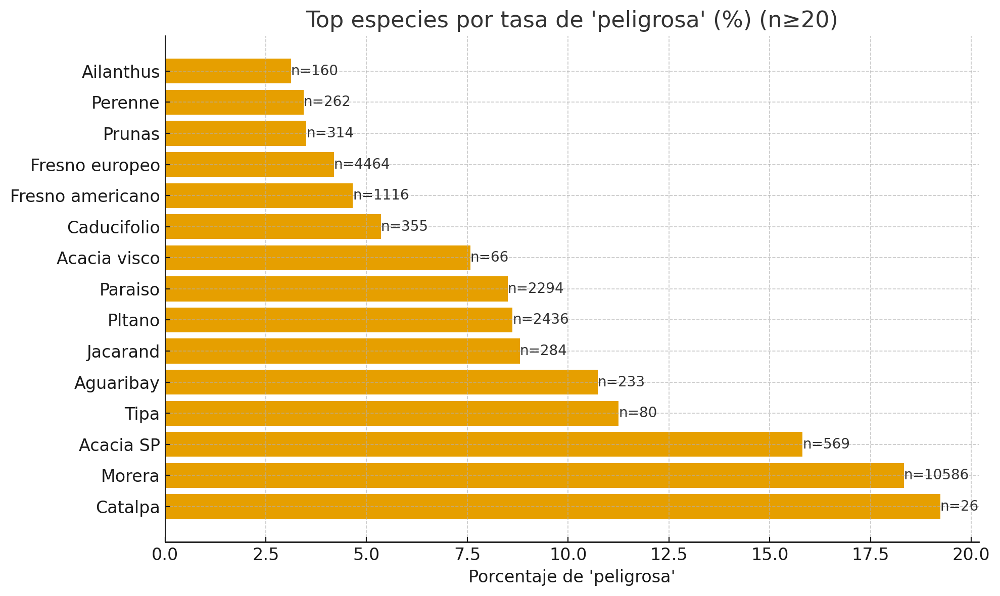
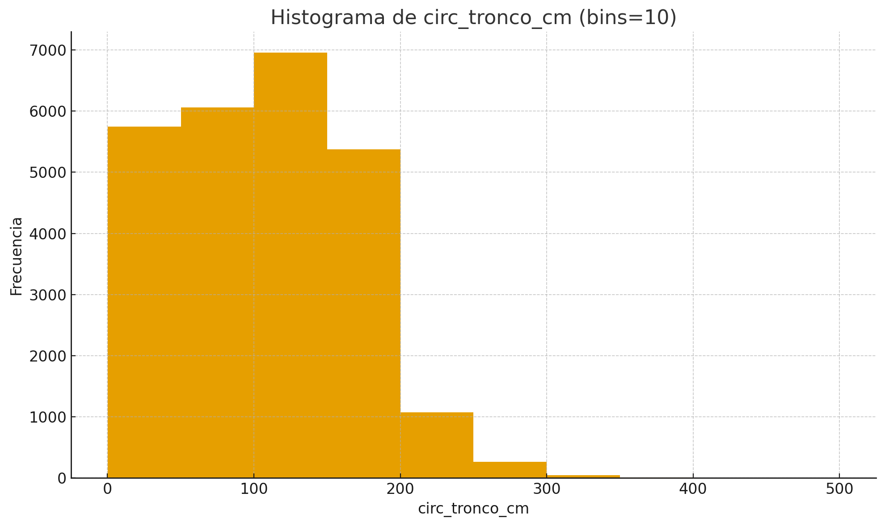
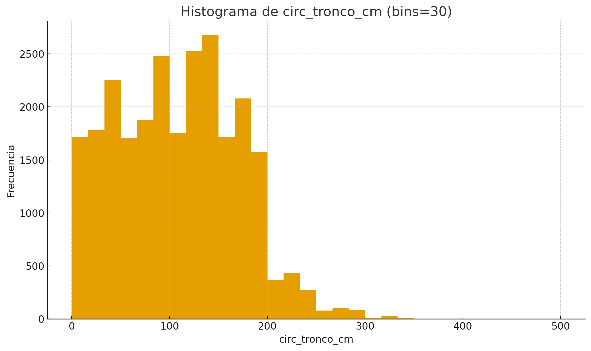
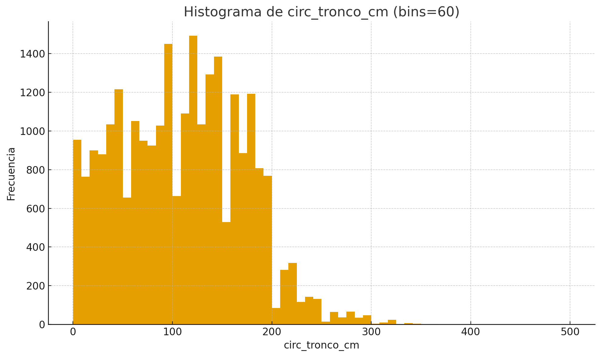
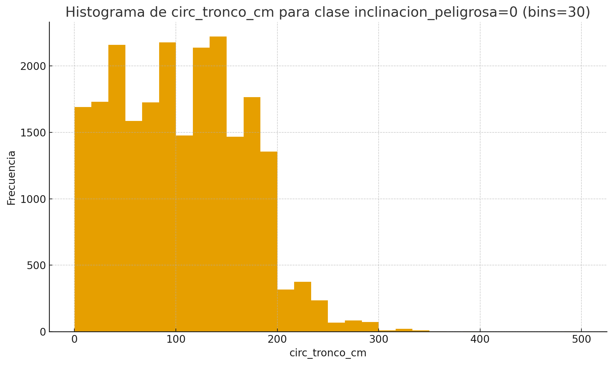
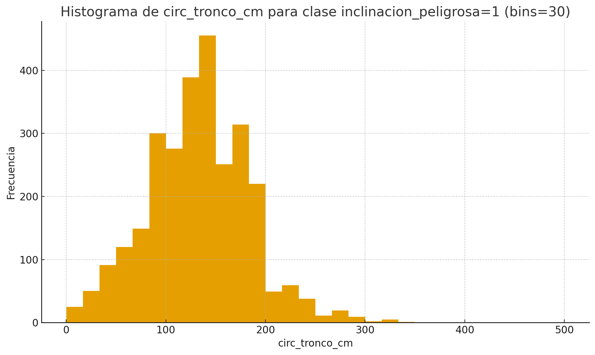

2-
    a-
    0 (no peligrosa): 22.697 (≈ 88.9%)
    1 (peligrosa): 2.833 (≈ 11.1%)
    

    b-
    Sección 2 y 3 presentan las tasas más altas de inclinacion_peligrosa en el dataset
    

    c-
    Catalpa y Morera son las especies más peligrosas.
    

3-
    a-
    
    
    

    b-
    
    